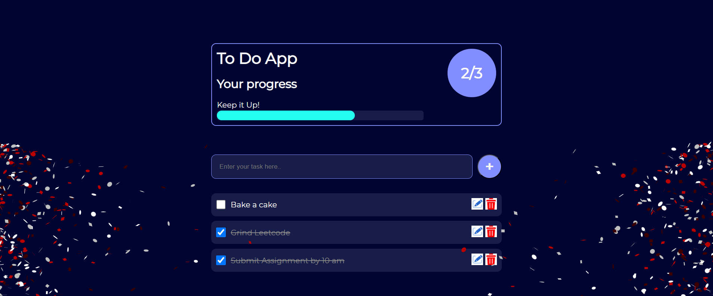

# Advanced To Do List App

A modern, feature-rich To Do List web application with CRUD operations, progress tracking, confetti celebration, and persistent local storage.

## Features

- **Add Tasks:** Quickly add new tasks using the input field and "+" button.
- **Edit Tasks:** Edit any task by clicking the edit icon.
- **Delete Tasks:** Remove tasks instantly with the delete icon.
- **Mark as Completed:** Check off tasks to mark them as done; completed tasks show a line-through effect.
- **Progress Bar:** Visual progress bar updates as you complete tasks.
- **Stats Display:** Shows the number of completed tasks out of the total (e.g., 2/3).
- **Confetti Celebration:** Enjoy a confetti animation when all tasks are completed!
- **Persistent Storage:** All tasks are saved in your browser's localStorage, so your list is always available.
- **Responsive UI:** Clean, modern design that works on desktop and mobile.

## How It Works

1. **Add a Task:** Enter your task and click the "+" button.
2. **Edit or Delete:** Use the edit and delete icons next to each task.
3. **Complete Tasks:** Check the box to mark a task as completed.
4. **Track Progress:** Watch the progress bar and stats update in real time.
5. **Celebrate:** Complete all tasks to trigger a confetti celebration!

## Tech Stack

- **HTML5**
- **CSS3** (custom styles, transitions)
- **JavaScript** (ES6+)
- **LocalStorage** for persistence
- **[tsParticles Confetti](https://github.com/tsparticles/confetti)** for celebration effect

## Getting Started

1. Clone or download this repository.
2. Open `index.html` in your browser.
3. Start managing your tasks!

## Screenshots

## License

MIT

---

> Advanced To Do List app with full CRUD operations, progress tracking, confetti celebration, and persistent local storage. Modern UI, edit/delete, and completion features included.
